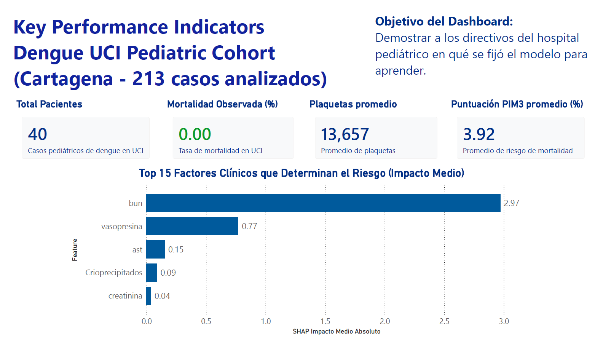
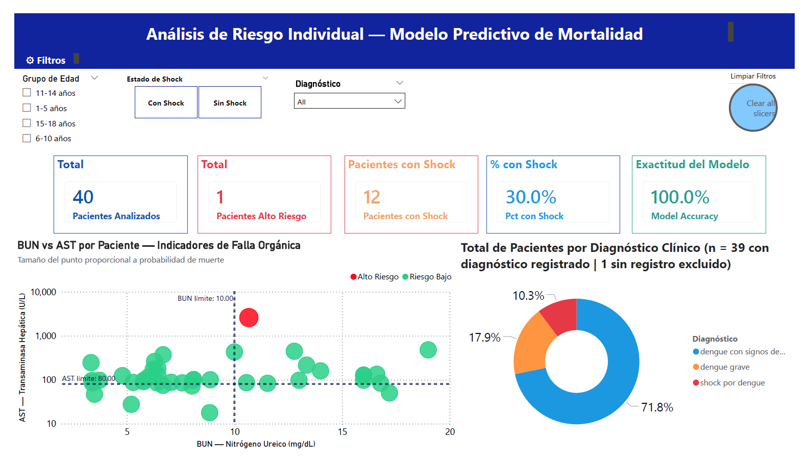
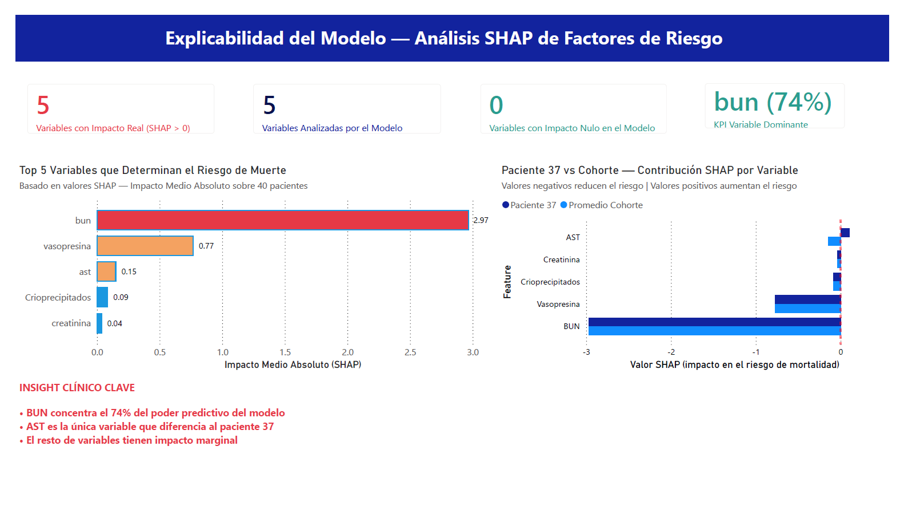

# Dengue-ICU-Pediatric-Analysis

## 🎯 Descripción general y objetivos del proyecto

Proyecto integral de Data Science, Machine Learning y visualización avanzada (Power BI) sobre el análisis del impacto clínico del Dengue en la UCI Pediátrica del Hospital Pediátrico de Cartagena.
Desarrollado bajo estándares de la industria, rigor estadístico y mejores prácticas de código _production-ready_ (Type hints, OOP, PEP8, CI/CD-ready).

- **Objetivo Principal:** Identificar los factores clínicos y de laboratorio (BUN, AST, Vasopresina) asociados a la severidad y probabilidad de mortalidad en pacientes pediátricos.
- **Limitantes:** Conjunto de datos pequeño (~200 muestras) con alta dimensionalidad de variables clínicas (75 features).
- **Enfoque Principal:** Priorización de un **EDA profundo y estadística inferencial** rigurosa, complementado con un pipeline de modelado predictivo XGBoost explicable mediante métricas SHAP.

## 📊 Dashboard: Inteligencia Clínica y Perfilamiento de Riesgo

El análisis predictivo se materializa en un Dashboard interactivo en Power BI compuesto por 3 páginas clave. Este dashboard está diseñado para soportar decisiones clínicas, proporcionando interpretabilidad total sobre el modelo de Machine Learning (SHAP).

### Página 1: Resumen General y Métricas Globales

Provee el panorama institucional y métricas base del cohorte analizado.

- **KPIs Clave:** Total de Pacientes (40 en test set), Mortalidad Observada (0.00%), Score PIM3 Promedio (3.92) y Promedio de Plaquetas (13,657).
- **Contexto:** Vista macro de los predictores globales más relevantes derivados del modelo XGBoost (importancia global SHAP).
- **Imagen:**
  

### Página 2: Análisis de Riesgo Individual — Indicadores de Falla Orgánica

Se centra en la estratificación de riesgo de cada paciente, combinando indicadores de daño hepático y renal.

- **Scatter Plot (BUN vs AST):** Cuadrantes clínicos divididos por límites fisiológicos (BUN=10, AST=80). Uso de escala logarítmica para gestionar outliers clínicos severos (AST de 2,589).
- **Perfilamiento de Riesgo:** Diferencia visual rápida entre el 97.5% de pacientes en Riesgo Bajo (puntos verdes) y el 2.5% en Alto Riesgo de mortalidad (punto rojo, Paciente 37).
- **Distribución Diagnóstica:** Gráfico de dona (Dengue grave, Dengue con signos de alarma, Shock por dengue) excluyendo con transparencia los registros nulos para garantizar la trazabilidad estadística.
- **Imagen:**
  

### Página 3: Explicabilidad del Modelo (SHAP) — ¿Qué aprendió el algoritmo?

Desmitifica el modelo "caja negra" demostrando de forma transparente cómo se llega a la predicción de mortalidad.

- **Reducción de Dimensionalidad:** De 75 variables analizadas, el dashboard demuestra que solo 5 tienen impacto real en la predicción del modelo.
- **Paciente 37 vs. Cohorte (Clustered Bar Chart):** Explica por qué el Paciente 37 está en alto riesgo: su valor extremo de AST es el único factor de riesgo positivo que lo diferencia de la media del grupo. El BUN concentra el 74% del poder predictivo.
- **Tabla de Detalle Clínico:** Desglose paciente a paciente con probabilidad de mortalidad asignada y todos los datos consolidados.
- **Imagen:**
  

> **💡 Insight Técnico:**
> Para conocer las respuestas técnicas y decisiones de diseño de datos en profundidad (limpieza en Power Query, lógica de imputación clínica, manejo del eje logarítmico, y explicaciones detalladas del impacto SHAP), consulte el documento **[DASHBOARD_FAQ.md](DASHBOARD_FAQ.md)** adjunto en el repositorio.

## 🧠 ¿Por qué este enfoque?

- **Rigor Estadístico:** Dado el tamaño del dataset (~200 registros), se priorizaron pruebas paramétricas y no paramétricas (Mann-Whitney U, Chi², Spearman) para evitar el riesgo de _overfitting_ al que son propensos los modelos de ML en muestras pequeñas.
- **ML Tooling:** XGBoost implementado como herramienta de modelado tabular por su robustez, complementado estrictamente con análisis de explicabilidad **SHAP** (Shapley Additive exPlanations).
- **Transparencia Clínica:** Se evitó la imputación sesgada de variables médicas (e.g. Diagnóstico) respetando la teoría de _Missing Not At Random (MNAR)_. Los vacíos de registro clínico se presentan transparentemente en el análisis.
- **Code Standards:** Arquitectura Modular OOP, Type Hints estrictos (Python 3.12), cumplimiento de linting/formateo (Ruff), Testing y validación de esquemas (Pandera).

## 🏗️ Estructura del proyecto (Modular OOP)

```bash
Dengue-ICU-Pediatric-Analysis/
├── config/
│   └── pipeline_config.yaml
├── data/
│   ├── processed/
│   │   └── dengue_uci_cleaned.csv
│   └── raw/
│       └── Base_de_Datos_Dengue_UCIP.csv
├── notebooks/
│   └── 01_dengue_uci_eda_modeling.ipynb
├── Power_BI/
│   └── images/
│       ├── P1.png
│       ├── P2.png
│       └── P3.png
├── src/
│   ├── data_cleaner.py
│   ├── data_loader.py
│   ├── eda_analyzer.py
│   ├── model_trainer.py
│   ├── statistical_analyzer.py
│   ├── utils.py
│   └── __init__.py
├── tests/
│   └── test_pipeline.py
├── .gitignore
├── pyproject.toml
├── DASHBOARD_FAQ.md
├── README.md
└── uv.lock
```

## ⚠️ Suposiciones y Riesgos (Análisis Proactivo)

- **Sesgo de Selección:** Casos provenientes de un solo centro de referencia; representa únicamente la población de cuidados intensivos y no casos ambulatorios.
- **Desbalance de Clases:** Fuerte desbalance en la variable objetivo (pocos eventos de "Muerte"); se utilizó validación cruzada estratificada (_Stratified CV_) y ponderación de clases (_class weights_).
- **Calidad de Datos:** Valores numéricos faltantes imputados mediante mediana con _flagging_ de registros nulos para mantener la integridad del análisis y aislar variables nulas no dependientes.

## 🛠️ Stack de Desarrollo

- **Environment**: uv (fast, reliable dependency management).
- **Linter/Formatter**: Ruff (PEP8 compliance).
- **Type Checker**: Mypy & Pylance (Strict typing).
- **CI/CD Ready**: Modular architecture prepared for automated testing.
